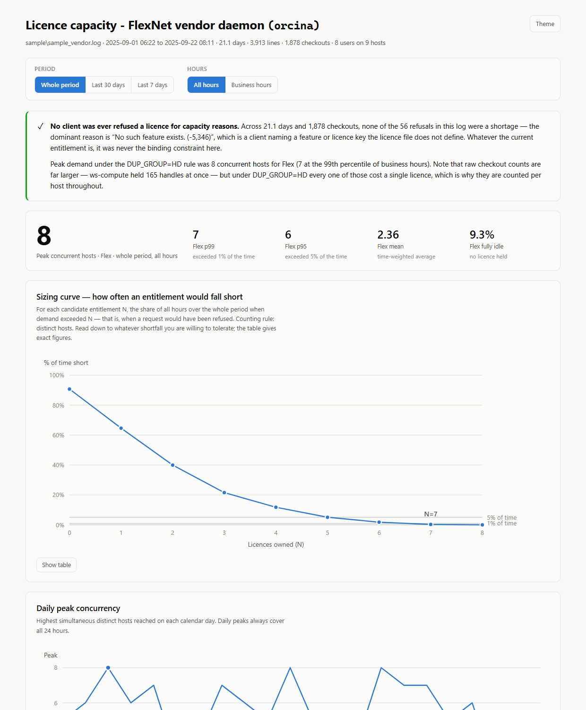

# FlexNet licence usage report

Turn an Orcina licence server log into a single self-contained HTML report that
answers one question: **how many licences do you actually need?**

Everything runs on your own machine. No data is uploaded anywhere, and the only
dependency is Python itself.



## What it tells you

- **Peak and sustained concurrent usage** per feature — time-weighted, so a
  brief spike does not masquerade as steady demand.
- **A sizing curve**: for each candidate licence count, the share of working
  time that demand would have exceeded it. This is the number to buy against.
- **When the pressure falls** — a weekday/hour heatmap of average concurrency.
- **How long licences are held**, which is where reclaimable capacity hides. A
  licence held for three days is usually an abandoned session, not work.
- **Whether anyone was ever actually refused a licence**, separating genuine
  shortages from clients asking for features your licence does not include.

The report is one HTML file. Open it in a browser, mail it to a colleague, and
filter it by period and working hours without re-running anything.

## Requirements

Python 3.8 or newer. Nothing else — no `pip install`, standard library only.

## Quick start

```bash
git clone https://github.com/Orcina-Ltd/flexnet-licence-report.git
cd flexnet-licence-report

python analyse_flexnet.py C:\ProgramData\Orcina\lmadmin\logs\orcina.log -o usage_data.json
python build_report.py
```

Then open `licence_capacity_report.html`.

A 30 MB, 650,000-line log takes a couple of minutes on the first step. The
second is instant, so you can re-run it freely.

### Try it without a log

The repository ships a synthetic log with invented users and machines:

```bash
python analyse_flexnet.py sample/sample_vendor.log -o sample/sample_data.json
python build_report.py -d sample/sample_data.json -o sample/sample_report.html
```

`sample/sample_report.html` is committed, so you can also just open it.

## Where to find the log

On the **licence server machine**, not on a client:

```
C:\ProgramData\Orcina\lmadmin\logs\orcina.log
```

That is the vendor daemon log written by `lmadmin`, and it is the file this tool
wants — every line in it is tagged `(orcina)`. Reading it is harmless while the
server is running, so there is no need to stop anything, though copying it to
your own machine first is usually more convenient.

If the tool reports that it found no checkout events, you are almost certainly
looking at an `lmadmin` or `lmgrd` log rather than the vendor daemon's.

## Before you start: the log needs TIMESTAMP lines

Vendor daemon log lines carry only a time of day — `14:37:41` — and no date. The
date comes solely from periodic `TIMESTAMP m/d/yyyy` lines, so without them the
tool cannot date anything and will stop with an error rather than guess.

Checking takes a second:

```
findstr /C:TIMESTAMP C:\ProgramData\Orcina\lmadmin\logs\orcina.log
```

If that prints nothing, add the following to the vendor daemon's options file
and restart the daemon:

```
TIMESTAMP 1
```

A log already written without it cannot be dated after the fact, so you will
need to enable it and then collect a fresh period. A few weeks gives a usable
picture, a couple of months a good one.

## Reading the report

### The sizing curve

The chart to make decisions from. For each candidate entitlement **N** it plots
the share of time that demand *exceeded* N — the share of time a request would
have been refused. Pick your tolerance and read across:

From the committed sample data, counting distinct hosts across business hours:

| Licences owned | Share of business hours short |
|---|---|
| 5 | 13.6% |
| 6 | 5.0% |
| 7 | 0.77% |
| 8 | 0% |

Read that as: seven licences would have covered 99.23% of working hours, and
eight would never have refused anybody.
Reference lines mark 5% and 1%, and the table view under the chart gives exact
figures for every count.

### One licence per machine, not per checkout

Orcina licences carry `DUP_GROUP=HD`, so **concurrent checkouts from the same
machine consume a single licence**. Every figure in the report counts distinct
hosts on that basis.

This matters more than anything else here, because a parallel batch run holds a
great many handles at once and they all cost one licence between them. In the
sample data a single machine reaches 165 simultaneous handles against a true
peak of 8 licences in use — counting checkouts rather than hosts would overstate
demand twentyfold. The raw figure appears in one place only, the "max handles on
one host" column, where it is a useful signal of duplicate-heavy automation
rather than a capacity number.

One caveat the report repeats: `HD` groups by host *and display*, but the log
never records the display. The tool assumes one display per host, which is right
for a workstation and wrong for a terminal server or Citrix host, where each
concurrent session consumes its own licence. If you run either, treat the
per-host figure as a lower bound. The report names any host it saw serving more
than one user, since those are the ones worth checking.

### Denials are usually not shortages

A refusal logged as `No such feature exists (-5,346)` means a client asked for
something your licence file does not define. That is a configuration matter, not
a capacity one, and buying licences will not fix it. Only
`Licensed number of users already reached` is a real shortage. The report counts
these separately and, for every refusal, measures what the daemon granted that
same user in the next five seconds — which is what distinguishes a harmless
probe from somebody genuinely blocked.

By default `Wave` is treated as an expected refusal: OrcaWave can in principle
be licensed against a `Wave` feature, but in practice it is taken through
`Flex`, so clients probe for `Wave`, are refused, and carry on. Adjust with
`--expected-denials` if your situation differs.

## Command reference

### `analyse_flexnet.py` — parse the log, write JSON

```
python analyse_flexnet.py LOG [-o usage_data.json] [options]
```

| Option | Default | Purpose |
|---|---|---|
| `-o, --out` | `usage_data.json` | Where to write the JSON |
| `--vendor` | `orcina` | Name in the `(vendor)` tag on each line |
| `--business-hours` | `8-18` | Working-hours window, whole hours |
| `--business-days` | `mon,tue,wed,thu,fri` | Working days |
| `--min-sessions` | `50` | Features with fewer checkouts stay in the tables but are left off the charts |
| `--expected-denials` | `Wave` | Features whose refusals are known to be harmless |
| `--no-casefold` | off | Treat `Ian` and `ian` as two people. Off by default, because one person often appears spelled both ways |
| `--title` | — | Heading for the report |

### `build_report.py` — render the JSON into HTML

```
python build_report.py [-d usage_data.json] [-t report_template.html] [-o licence_capacity_report.html]
```

Separate from the parser so you can restyle the report without re-reading a
30 MB log. Edit `report_template.html` and re-run it.

### `make_sample_log.py` — generate a synthetic log

```
python make_sample_log.py -o sample/sample_vendor.log [--days 21] [--seed 42]
```

Deterministic for a given seed. Useful for trying the tool out, and for
reproducing a bug report without sending anybody your real log.

## Tests

```bash
python -m unittest discover -s tests -v
```

51 tests, standard library only, nothing to install. Each builds the log it needs
inline, so the input sits beside the assertion about it.

They cover the parts of this that have actually gone wrong: inferring midnight
from a clock that only reports the time of day, thread-jitter lines that must
*not* be read as midnight, pairing checkouts across a daemon restart, the
same-second checkin/checkout tie-break, counting one machine's many handles as a
single licence, reporting periods containing no activity at all, CRLF logs, and
markup in a feature name failing to escape into the report. CI runs them on Linux
and Windows.

## Privacy

**The report contains the usernames and hostnames of everyone who used a
licence.** It is a personnel record as much as a capacity study. Treat it
accordingly before circulating it, and note that the data is embedded in the
HTML file itself, not merely displayed by it.

`.gitignore` is set up to keep logs, `usage_data.json` and generated reports out
of version control for exactly this reason. The only committed log is the
synthetic sample, in which every name is invented.

## How it handles the awkward parts

Vendor daemon logs are less tractable than they look. Each decision below is
also documented in the report's own "Method, assumptions and data-quality notes"
section, alongside the counts that show how often it mattered, so you can judge
whether to trust the figures.

- **Dates.** Carried forward from `TIMESTAMP` anchors, with midnight inferred
  only when the clock jumps backwards by more than 12 hours. A smaller threshold
  is wrong: the daemon writes from several threads, so a well-ordered log still
  contains lines a few minutes out of sequence, and reading those as midnight
  invents extra days. Every `TIMESTAMP` re-anchors the walk, and disagreements
  are counted and reported rather than hidden.
- **Pairing.** An `IN:` line never says which `OUT:` it closes, so checkouts are
  matched oldest-first per (feature, user, host). Handles still open at a daemon
  restart are closed at that instant, because a restart genuinely releases them
  — leaving them open would manufacture multi-week sessions and wildly inflate
  the peaks.
- **One-second resolution.** When a checkin and a checkout share a logged
  second, the release is processed first, on the grounds that this is nearly
  always one handle being handed over. The opposite convention invents peaks
  that never happened, so reported peaks are the lower of the two defensible
  readings.
- **Percentiles are time-weighted**, not per-event. p95 is the level concurrency
  stayed at or below for 95% of the elapsed time, which is what you want for
  sizing.

## What it cannot tell you

The log records what was *served*, never what was *wanted*. It holds no
entitlement counts, so it cannot say in absolute terms whether you are over- or
under-licensed — compare the sizing curve against your own licence file. Demand
suppressed by users who gave up waiting is invisible, though if there are no
capacity denials there is no evidence of any.

## Licence

MIT — see [LICENSE](LICENSE).
